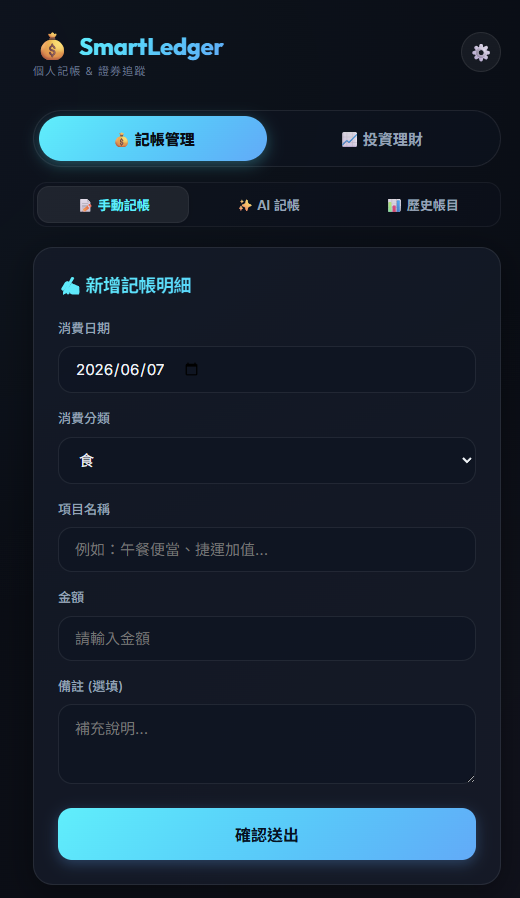
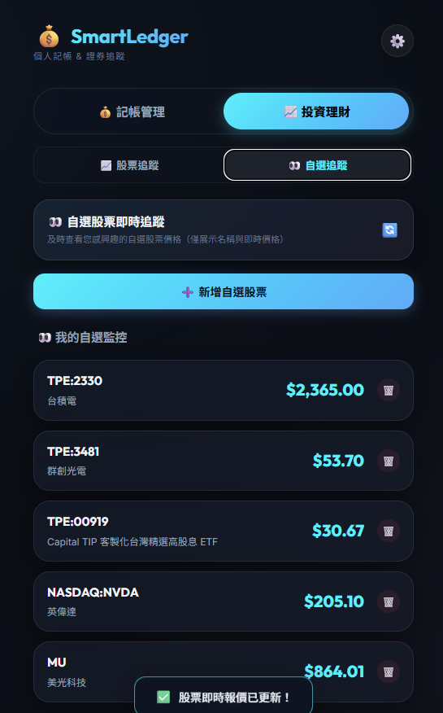

# 💰 SmartLedger - 個人智慧記帳與股票追蹤系統

[](https://github.com/ChenYuHsu413/AccountSystem/actions/workflows/deploy.yml)

> 🚀 **線上 Demo 連結**：[https://chenyuhsu413.github.io/AccountSystem/](https://chenyuhsu413.github.io/AccountSystem/)

`SmartLedger` 是一款專為手機與行動網頁優化的個人理財與資產追蹤系統。本系統採用 **Serverless 無伺服器架構**，前端以 React 19 + Vite 構建，並使用 **Google 試算表 (Google Sheets)** 作為雲端資料庫。同時整合了 **Gemini AI** 智慧解析與**語音輸入**功能，提供流暢、安全且極致美觀的個人記帳體驗。

---

## 📱 系統截圖參考

| 💰 記帳管理模組 | 📈 投資理財模組 |
| :---: | :---: |
|  |  |

---

## ✨ 核心功能

本系統經由重構優化，目前劃分為兩大核心模組：

### 💰 記帳管理
* **📝 手動記帳**：極簡流暢的表單設計，支援日期、金額、分類、項目名稱與備註之輸入，並與 Google 試算表即時同步。
* **✨ AI 智慧記帳**：
  * **Gemini 自然語言解析**：輸入如「昨天晚餐吃麥當勞花了一百五十元」，AI 即自動解析為分類、項目與金額並直接同步至試算表。
  * **多筆明細同時記**：支援在單次對話中記錄多個項目，如「午餐 120 捷運 30」，會自動解析為餐飲 120 元與交通 30 元兩筆資料寫入。
  * **🎤 行動端語音一鍵記**：整合語音辨識服務，點擊麥克風即可直接說話輸入，辨識完成後自動釋放錄音資源，完全不佔用裝置權限。
* **📊 歷史帳目**：
  * 磨砂玻璃質感（Glassmorphism）卡片條列所有消費項目。
  * 提供「本月總支出」與「累計總支出」摘要，並搭載**消費類別佔比視覺化條狀圖**。
  * 支援單筆消費刪除，電腦版與手機版均採用置中對齊的二次確認對話框。

### 📈 投資理財
* **📈 股票追蹤 (Stock Portfolio)**：
  * 彙整台美持股總成本、即時證券市值與累積帳面損益。
  * 即時報價、市值與損益利用 Google 試算表內建 `GOOGLEFINANCE` 公式進行雲端更新運算。
  * 提供**修改股數**與**修改買入成本單價**功能。
  * 新增持股代碼時實作 **小檢查 (Validator)**，若有該股會自動帶入中文名稱、當前股價並預填 1000 股與預設成本。若代碼不存在會跳出錯誤提示。
* **👀 自選追蹤 (Watchlist)**：
  * 專屬自選股追蹤頁面，僅展示自選股票的名稱與即時價格，不需填入股數與成本，供隨時監控市場價格。
  * 同步支援代碼輸入驗證與自動帶入名稱功能。
* **🔤 股票名稱中文化**：
  * 自動翻譯 Google Finance 傳回的英文股票名稱為繁體中文，清理冗長公司後綴，並將常見大型股映射為直覺簡稱（例如：`台灣積體電路製造` ➡️ **台積電**、`Apple Inc.` ➡️ **蘋果**）。

---

## 🛠️ 技術棧與架構

* **前端**：React 19, Vite, Vanilla CSS (精緻現代暗黑美學、毛玻璃陰影、互動微動畫)。
* **後端 / API 路由**：Google Apps Script (GAS) ── 充當 Serverless API 處理跨網域 CORS 請求並與 Google Sheets 交互。
* **資料庫**：Google Sheets (Google 試算表)。
* **自動部署**：GitHub Actions + GitHub Pages。

---

## 🚀 快速開始與本地開發

### 1. 複製專案並安裝依賴
```bash
git clone https://github.com/ChenYuHsu413/AccountSystem.git
cd AccountSystem
npm install
```

### 2. 本地開發執行
```bash
npm run dev
```
啟動後在瀏覽器開啟：`http://localhost:5173/`。

---

## ⚙️ Google 試算表與 GAS 詳細設定教學

本系統完全不需要租用付費伺服器或 SQL 資料庫，所有資料都儲存在您自己的 Google 帳戶中。請按照以下詳細步驟完成設定：

### 步驟 1：建立試算表
1. 登入您的 Google 帳戶，前往 [Google 雲端硬碟](https://drive.google.com/) 或 [Google 試算表](https://docs.google.com/spreadsheets/)。
2. 點擊左上角的 **「新增」 ➡️ 「Google 試算表」** 建立一個全新的空白試算表。
3. 為您的試算表取一個名稱（例如：`SmartLedger 資料庫`）。
4. **💡 核心技巧：不用手動建立工作表與欄位！** 本系統具備「自動初始化」功能。您只需保留建立出來的全空試算表，當後端程式第一次被呼叫時，會自動幫您建立 `Bookkeeping`、`Stocks`、`Watchlist` 工作表，並寫入對應的標頭與範例公式。

### 步驟 2：開啟 Google Apps Script (GAS)
1. 在剛剛建立的試算表上方選單中，點選 **「擴充功能」 ➡️ 「Apps Script」**。
2. 系統會在新分頁中開啟 GAS 編輯器，請將專案名稱修改為 `SmartLedger-API`。

### 步驟 3：貼入後端程式碼
GAS 編輯器左側預設會包含一個 `程式碼.gs` 的檔案。
1. 將專案中的 [gas/Code.gs](file:///gas/Code.gs) 程式碼全部複製，覆蓋貼入到編輯器的 `程式碼.gs` 中。
2. 在左側「檔案」旁點擊 **「+」 ➡️ 「新增指令碼」**，建立一個新檔案並命名為 `Database`。
3. 將專案中的 [gas/Database.gs](file:///gas/Database.gs) 程式碼全部複製，覆蓋貼入到 `Database.gs` 檔案中。
4. 依據相同步驟，再建立一個名為 `Gemini` 的檔案，並將專案中的 [gas/Gemini.gs](file:///gas/Gemini.gs) 程式碼全部複製覆蓋貼入。
5. 點擊上方選單中的 **「儲存 (磁碟圖示)」** 保存所有檔案。

### 步驟 4：將 API 部署為網頁應用程式
為了讓您的網頁應用程式能讀寫這份試算表，需要將此腳本發布為 API：
1. 點擊編輯器右上角的 **「部署」 ➡️ 「新增部署」**。
2. 在彈出的視窗中，點選「選取類型」旁的齒輪圖示，選擇 **「網頁應用程式」 (Web App)**。
3. 填入說明（例如：`v1.0`）。
4. **進行關鍵權限設定**：
   * **執行身分 (Execute as)**：選取 **「我」 (Me)** ➡️ 這將使程式以您的權限存取該試算表。
   * **誰有權存取 (Who has access)**：選取 **「所有人」 (Anyone)** ➡️ 這允許前端網頁向此 API 發送請求。
5. 點選 **「部署」**。
6. *如果是第一次部署，Google 會彈出「授權存取」視窗。點選「授予存取權」➡️ 選擇您的 Google 帳戶 ➡️ 點選「進階」 ➡️ 點選「前往 SmartLedger-API (不安全)」 ➡️ 點選「允許」*。
7. 部署完成後，請**複製彈出視窗中的「網頁應用程式 URL」** (格式為 `https://script.google.com/macros/s/XXXXXX/exec`)。

### 步驟 5：於前端設定網址
1. 打開您的線上 Demo 網頁（或本地運行的網頁）。
2. 點選右上角的 **⚙️ (設定齒輪)** 按鈕展開設定面板。
3. 將步驟 4 複製的 **網頁應用程式 URL** 完整貼入輸入框中，並點選 **「儲存網址」**。
4. **驗證設定**：試著前往「手動記帳」新增一筆帳目，然後返回您的 Google 試算表，您會看到 `Bookkeeping` 工作表已自動產生，並且新資料已經成功寫入！

*(備註：若要啟用 Gemini AI 智慧記帳，請前往 Google AI Studio 申請免費的 API Key，並在「AI 記帳」分頁的設定中填入即可。)*

---

## 📁 專案開發與歷史對話文件

為了透明呈現此專案的演進歷程與詳細的工作指標，我們特別整理了以下文件置於 `docs/` 目錄中：

* **[對話指令歷史記錄 (docs/log.md)](./docs/log.md)**：完整收錄了使用者在專案開發過程中，對 AI 助手下達的所有核心功能指示與錯誤修正命令。
* **[詳細專案工作報告 (docs/工作報告.md)](./docs/工作報告.md)**：包含本專案的時程演進、核心模組實現技術細節、Serverless 資料庫流向圖以及架構優化成果總結。