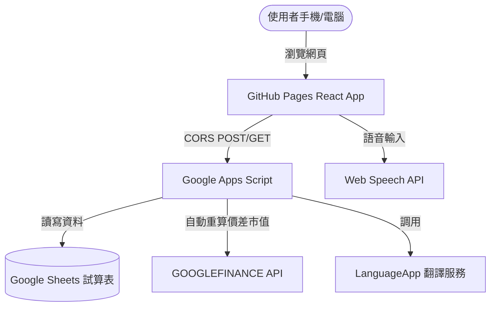

# 📊 SmartLedger 專案開發工作報告

本報告針對 `SmartLedger` 專案的開發演進、功能實現以及優化歷程進行詳細彙整，說明我們如何將一個基礎記帳程式迭代為具備 **雙層智慧導覽**、**AI 與語音雙強記帳**、以及 **台美股即時資產追蹤** 的行動端理財系統。

---

## 📅 專案開發時程與功能演進

依據與使用者的對話指令歷史記錄（詳見 [log.md](log.md)），開發過程分為四個核心階段：

### 階段一：基礎部署與環境打通 (指令 1 - 8)
* **自動化部署 (CI/CD)**：設定 GitHub Actions 工作流（`deploy.yml`），實作推送到 `main` 分支時自動打包 React 19 與 Vite 專案並發布至 GitHub Pages。
* **路徑相容性修復**：修正 Vite 設定檔中的 `base` 路徑為 `/PersonalAccountSystem/`，解決 GitHub Pages 部署後資源讀取錯誤（白畫面）的問題。

### 階段二：記帳功能完善與體驗優化 (指令 9 - 10, 18, 22 - 26)
* **歷史明細與 CRUD 刪除**：
  * 新增「📊 歷史帳目」頁面，以磨砂玻璃質感（Glassmorphism）卡片呈現每筆消費。
  * 實作單筆資料刪除功能，並加入**防誤觸二次確認對話框**。後續根據指令，將對話框於電腦版與手機版全面改為居中對齊以提升直覺性。
* **消費類別視覺化 (Visualized Chart)**：
  * 在歷史分頁上方新增消費大類別統計，以直觀的彩色佔比條視覺化呈現「哪類花最多／最少」，並針對手機端進行了響應式排版優化。
* **行動端 UI/UX 修正**：
  * 修復 iOS Safari 下日期選擇器（Date Input）寬度跑版、跑位以及無法對齊的 CSS 問題。

### 階段三：AI 自然語言記帳與語音辨識優化 (指令 11 - 12, 19 - 23)
* **語音輸入機制改良 (Web Speech API)**：
  * 解決手機端（如 iOS）重複彈出麥克風存取權限但無法辨識的權限循環問題。
  * 改良語音互動流程：使用者點擊麥克風 🎤 按鈕後，**直接開始語音輸入**，無須再次點擊文字框，提升單手操作效率。
  * 實作**語音辨識自動結束與資源回收**，防止錄音線程持續佔用麥克風（直到關閉瀏覽器）。
* **Gemini AI 3.5 升級與多筆資料解析**：
  * 調整 Gemini API 調用模型，確保使用最新高性能模型。
  * 擴充 Gemini AI 提示詞與後端解析邏輯，使其能夠在單次自然語言輸入中**同時分析多種消費明細**（例如：「買了午餐 120 元和坐捷運 30 元」➡️ 同時拆分為餐飲 120 元、交通 30 元兩筆資料寫入試算表）。

### 階段四：證券理財模組與中文命名 (指令 7, 13 - 17, 27 - 34)
* **台美持股損益看板 (Stock Portfolio)**：
  * 自動計算持股總成本、即時證券市值與累計損益，且支援無持股狀態下的防崩潰防呆機制（預設無持股畫面）。
  * 實作**修改股數**與**修改買入成本單價**功能，數據即時回傳 Google Sheets 公式並重算。
* **自選股票追蹤 (Watchlist)**：
  * 新增「自選追蹤」頁面，專供使用者輸入股票代號以即時追蹤價格，不需輸入股數與成本。
* **股票代碼小檢查與預填 (Validator)**：
  * 輸入代碼後提供「🔍 驗證並帶入」按鈕，呼叫後端 Google Finance：
    * **有此股**：預填當前價格，並自動將股數預設為 `1000` 股，成本價預設為當前股價。
    * **無此股**：彈出錯誤提醒。
* **股票名稱中文翻譯與清理**：
  * 調用 Apps Script 的 `LanguageApp.translate` 把 Google Finance 返回的英文股票名稱翻譯成繁體中文。
  * **不論是否有翻譯**，都使用正規表示式清除公司尾綴（如`股份有限公司`、`有限公司`、`Inc.`、`Ltd.` 等）。
  * 加入常見大型標的簡稱映射（如 `台灣積體電路製造` ➡️ **台積電**、`Apple Inc.` ➡️ **蘋果** 等）。

### 階段五：雙層模組導覽重構 (指令 33 - 34)
* 將原先扁平的五個 Tabs 重構為雙層導覽：
  * **💰 記帳管理**（手動記帳、AI 記帳、歷史帳目）
  * **📈 投資理財**（股票追蹤、自選追蹤）
* 使用 Segmented Control 漸層藥丸與毛玻璃質感，使整個 App 的層次更加分明且精緻。

---

## 🛠️ 架構設計與技術指標

本專案採用 **極簡無伺服器 (Serverless) 微前端架構**：

### 1. 前端架構
* **React 19 & Vite**：建構速度極快，搭配 React 19 的新特性進行高效渲染。
* **Vanilla CSS (暗黑毛玻璃質感)**：避開 Tailwind 的臃腫，使用精準 CSS 變數定義設計系統，運用 `backdrop-filter: blur` 營造高階暗黑美學。
* **瀏覽器原生 Web Speech API**：實作零延遲的語音轉文字功能。

### 2. 後端與資料儲存 (GAS + Google Sheets)
* **Apps Script API Gateway**：
  * 以 `doGet` 與 `doPost` 負責接收前端請求並解析 JSON。
  * 使用 `text/plain` 格式繞過瀏覽器的複雜 CORS 預檢限制。
* **Google 試算表數據庫**：
  * `Bookkeeping`：記錄日期、分類、項目、金額與備註。
  * `Stocks`：記錄代號、名稱、成本、股數，並使用 `=GOOGLEFINANCE(ticker, "price")` 自動算即時價、現值與損益。
  * `Watchlist`：記錄自選股代號與即時價格公式。

---

## 📈 專案成果總結

1. **零成本雲端資料庫**：透過 Google Apps Script 與 Google Sheets 的結合，完美實現了**不需要付費購買伺服器與資料庫**即可運作的雲端理財系統。
2. **極致的手機單手體驗**：藉由雙層大按鈕藥丸設計、語音一鍵輸入、二次置中確認等細節，打造了無懈可擊的手機瀏覽體驗。
3. **資訊在地化**：克服了 Google Finance 預設回傳英文名稱的限制，完全中文化的股票名稱讓台灣使用者能一眼看懂持股狀況。
